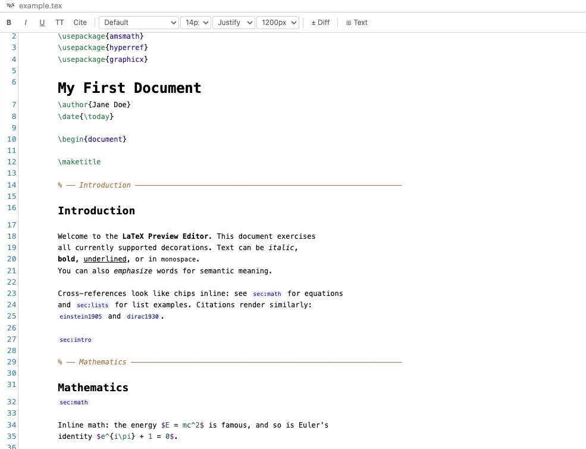

# LaTeX Preview Editor

A VS Code extension that replaces the default `.tex` file editor with a hybrid WYSIWYG experience powered by [CodeMirror 6](https://codemirror.net/). Write LaTeX in a clean, readable editor that renders syntax decorations, environment highlights, and inline formatting — while keeping your raw LaTeX source fully intact.

---

## Features

### Syntax-aware decorations
- **Inline formatting** — `\textbf{}`, `\textit{}`, `\underline{}`, `\texttt{}`, `\emph{}` and more are visually rendered as bold, italic, underlined, and monospace text directly in the editor.
- **Environment highlighting** — `\begin{...} ... \end{...}` blocks are visually grouped with subtle background highlights.
- **LaTeX syntax highlighting** — full syntax colouring via CodeMirror's legacy `stex` mode.




## Installation

```
git clone https://github.com/joon-klaps/latex-preview-editor-vscode.git
cd latex-preview-editor-vscode
npm install
npm run build
```

```bash
npm install -g @vscode/vsce
vsce package
code --install-extension latex-preview-editor-*.vsix
```


### Toolbar
All controls live in a persistent header bar that stays visible in every mode:

| Control | Description |
|---|---|
| **B** | Wrap selection in `\textbf{}` · `Ctrl/Cmd+B` |
| *I* | Wrap selection in `\textit{}` · `Ctrl/Cmd+I` |
| <u>U</u> | Wrap selection in `\underline{}` · `Ctrl/Cmd+U` |
| `TT` | Wrap selection in `\texttt{}` · `Ctrl/Cmd+Shift+M` |
| Cite | Wrap selection in `\cite{}` · `Ctrl/Cmd+Shift+R` |
| **Font ▾** | Switch editor font (Default / Courier New / Consolas / Georgia / Times New Roman / Arial) |
| **Size ▾** | Change font size (11 – 20 px) |
| **Align ▾** | Left or Justified text alignment |
| **± Diff** | Toggle git diff decorations (off by default) |
| **⊞ Text** | Switch to plain-text mode (raw textarea) |
| **◀ Preview** | Return to LaTeX preview mode |

### Git diff decorations (`± Diff`)
Enable the diff toggle to see changes relative to the last committed version (`HEAD`):
- 🟢 **Green** line highlight + gutter bar — added lines; added words highlighted in green
- 🟡 **Yellow** line highlight + gutter bar — modified lines; changed words highlighted in green, removed words shown inline in ~~red strikethrough~~
- 🔴 **Red** bar — deleted lines (shown as a thin bar at the deletion point)

Diff is recomputed automatically every time you save.

### Plain-text mode (`⊞ Text`)
Click **⊞ Text** in the toolbar to switch to a plain `<textarea>` showing the raw LaTeX source — useful for bulk edits or pasting. Changes sync back to the file in real time. Click **◀ Preview** to return to the decorated editor. The toolbar remains visible throughout.

---

## Requirements

- **VS Code** ≥ 1.74.0
- **Node.js** ≥ 16 (for building from source)
- A **git** repository is required for diff decorations; the extension works normally without one.

---

## Getting Started

1. Install the extension
2. Open any `.tex` file — the LaTeX Preview Editor opens automatically as the default editor.
3. Right-click the file tab → **Reopen Editor With…** → **Text Editor** if you ever need VS Code's stock editor.

---

## Project Structure

```
src/
  extension.ts            # Extension entry point
  LaTeXEditorProvider.ts  # Custom editor provider, git diff computation
webview/
  editor.ts               # CodeMirror setup, toolbar logic, message handling
  decorations/
    text.ts               # Inline formatting decorations
    environments.ts       # \begin/\end environment decorations
    diff.ts               # Git diff StateFields, gutter markers, theme
    math.ts               # (inactive) KaTeX math preview — kept for future use
    figures.ts            # (inactive) Figure widget — kept for future use
    index.ts              # Re-exports for editor.ts
build.mjs                 # esbuild bundler script
```

---

## Building from Source

```bash
# Install dependencies
npm install

# One-off build
npm run build

# Watch mode (rebuilds on file change)
npm run watch
```

The build outputs two files to `dist/`:
- `dist/extension.js` — the VS Code extension host bundle
- `dist/webview.js` — the CodeMirror webview bundle

---

## Known Limitations

- Math preview (`\[...\]`, `$...$`) is not currently rendered — raw LaTeX is shown. Re-enabling KaTeX is planned.
- Figure image preview was removed due to cursor interaction issues with CodeMirror 6 block widgets.
- Diff decorations require a `git` binary on `PATH` and a committed baseline; untracked files show no diff.
- The `± Diff` toggle is **off by default** — enable it when reviewing changes.

---

## License

MIT
